# 🦜 SQLChat: Converse with Your Databases using AI! 💬

[](https://www.gnu.org/licenses/gpl-3.0)
Dive into the world of conversational data exploration with SQLChat! 🚀 This project empowers you to interact with your SQL databases using natural language, thanks to the magic of LangChain, open-source LLMs (via Groq), and Streamlit.  Ask questions in plain English and get instant answers from your data! 🤖  Currently, SQLChat focuses on `SELECT` queries, enabling you to retrieve and analyze your data with ease.
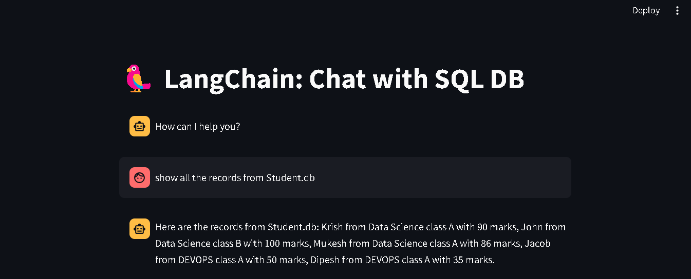

## ✨ Features

* **Natural Language Queries (SELECT Only):** Ask questions about your data in plain English.  SQLChat currently supports `SELECT` queries for retrieving information.  More query types coming soon! 🗣️
* **Multi-Database Support:** Connect to both SQLite and MySQL databases. 🗄️
* **Interactive Chat Interface:**  A user-friendly Streamlit chat interface makes interacting with your data a breeze. 💬
* **AI-Powered Insights:**  Leverages the power of open-source LLMs (via Groq) to understand your queries and generate insightful responses. 🧠
* **Real-time Streaming Responses:**  Experience a dynamic chat with streaming responses from the LLM. ⏳
* **Customizable Settings:** Easily configure the database connection details and Groq API key. ⚙️
* **Open Source and GPL Licensed:**  Freely use, modify, and distribute the code under the GPL license. 🧑‍💻

## 🖼️ 📸 Example Usage(Questions and their answers, Click to view)

| Using **SQLite** | Using **SQLite** | Using **SQLite** |
|---------|---------|---------|
| 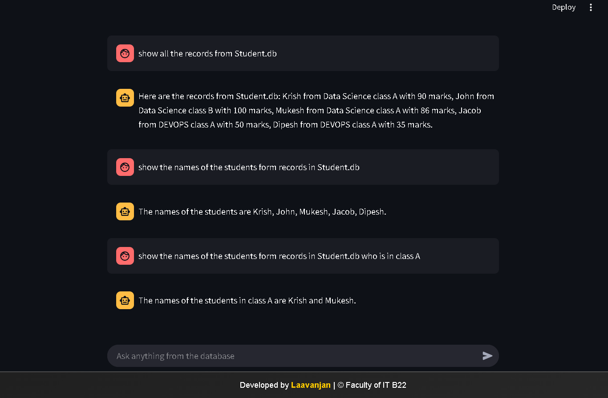 | 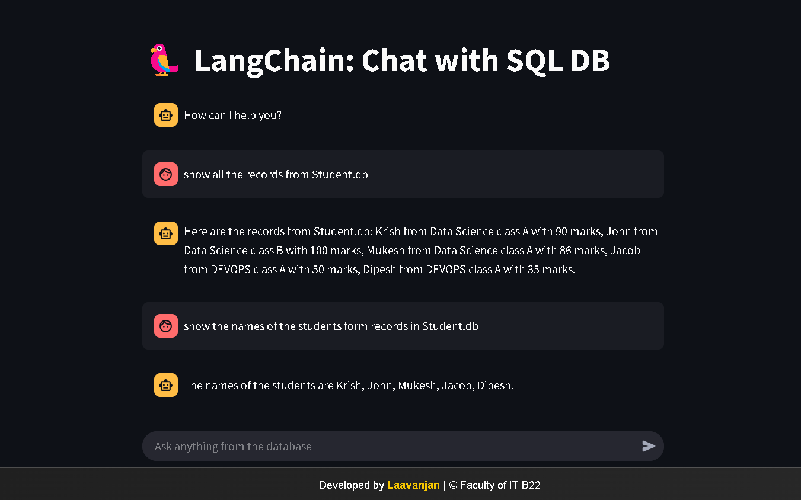 |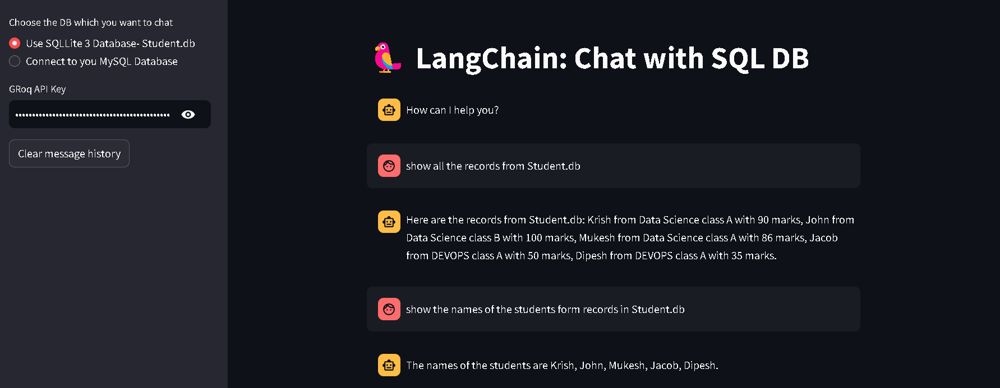 |
| Using **MYSQL** | Using **MYSQL** | MYSQL TABLE |
| 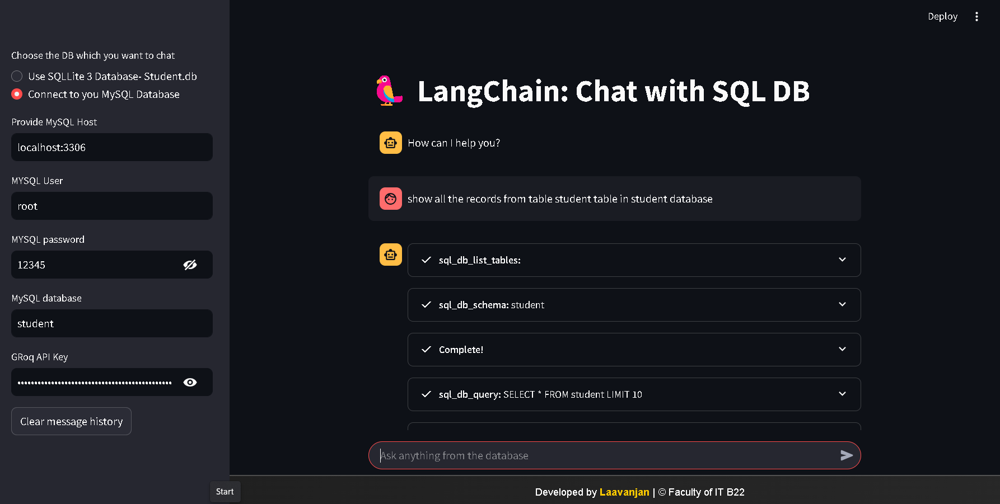 |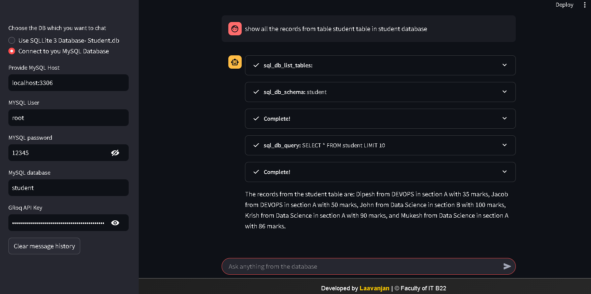 | 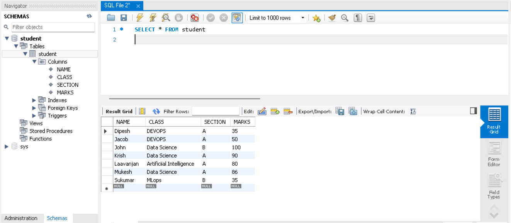 |
| Using **MYSQL** | Using **MYSQL** | Using **MYSQL** |
| 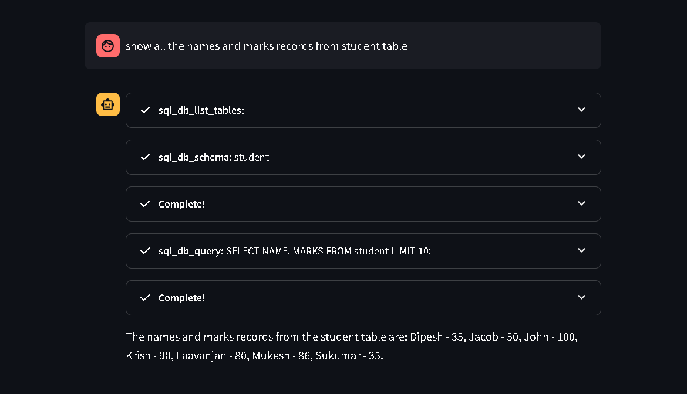 |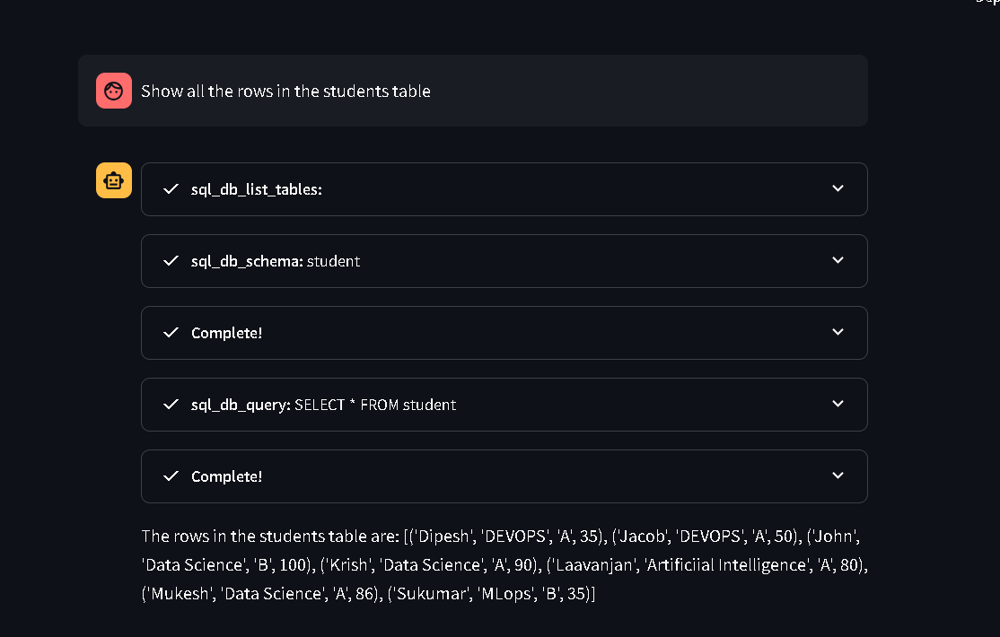 | 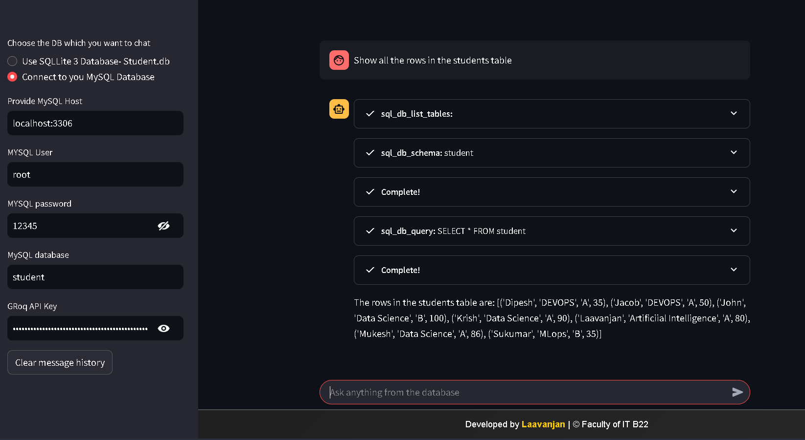 |
|  **MYSQL** interface| **SQLite** interface| 
| 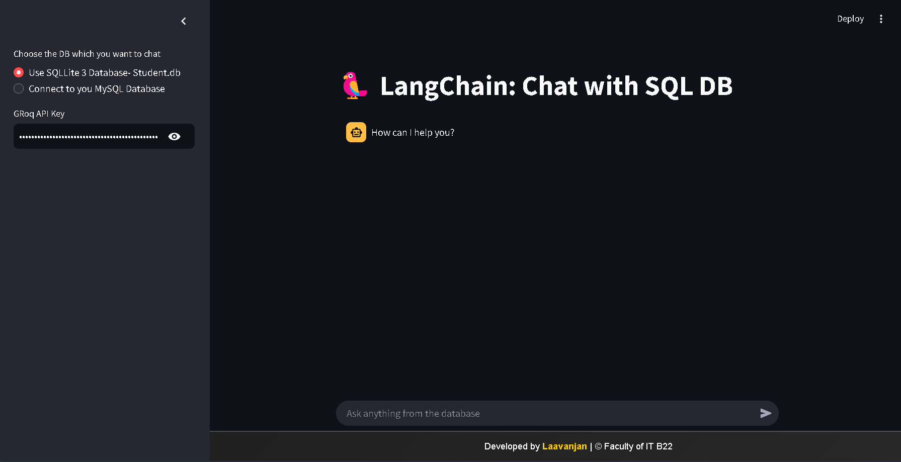 |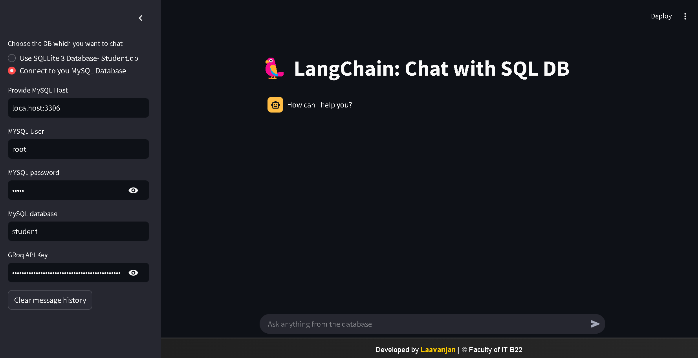 | |

*(Screenshots showcasing the application's interface and features click to view)*

## 🛠️ Installation (Conda Recommended)

1. **Clone the repository:**

```bash
git clone [https://github.com/laavanjan/SQLChat.git](https://www.google.com/search?q=https://github.com/laavanjan/SQLChat.git)  # Replace with your repo URL
cd SQLChat
```

2. **Create a Conda environment:**

```bash
conda create -n sqlchat python=3.9  # Or your preferred Python version
conda activate sqlchat
```

3. **Install the required packages:**

```bash
conda install -c conda-forge streamlit langchain sqlalchemy mysql-connector-python  # For MySQL
pip install langchain-groq
```

4. **Set up environment variables:**

* Create a `.env` file in the root directory.
* Add your Groq API key:

```
GROQ_API_KEY="YOUR_GROQ_API_KEY"
```

5. **Set up your database:**

* **SQLite:**  The `student.db` database is included in the repo. You can populate it using the `sqlite.py` script.
* **MySQL:**  Provide your MySQL connection details in the Streamlit sidebar when selecting the MySQL option.

6. **Run the Streamlit application:**

```bash
streamlit run app.py
```

## ⚙️ Usage

1. Open the Streamlit application in your web browser.
2. Choose your database type (SQLite or MySQL) in the sidebar.
3. If using MySQL, enter the connection details.
4. Enter your Groq API key in the sidebar.
5. Start chatting with your database by typing your `SELECT` queries in the chat input.  For example: "What is the average mark in Data Science class?" or "Show me all students in the DEVOPS class."
6. The application will use the agent to query the database and generate a response.

## 🗄️ Database Setup (SQLite Example)

The included `sqlite.py` script helps create and populate the `student.db` SQLite database.

```bash
python sqlite.py
```

This script creates a `STUDENT` table with `NAME`, `CLASS`, `SECTION`, and `MARKS` columns and inserts some sample data.

## 📚 Technologies Used

* **Python:** The core programming language.
* **Streamlit:** For building the interactive web application.
* **LangChain:** For agent management and tool integration.
* **Groq:** For accessing the open-source LLM.
* **SQLite:** For local database storage.
* **MySQL:** For connecting to MySQL databases.
* **SQLAlchemy:** For database interaction.
* **mysql-connector-python:** For MySQL connectivity.

## 🚧 Roadmap (Future Enhancements)

* Support for more SQL query types (e.g., `INSERT`, `UPDATE`, `DELETE`).
* Enhanced error handling and user feedback.
* Improved performance and scalability.
* More advanced natural language understanding.

## 🤝 Contributing

Contributions are welcome!  Feel free to open issues and submit pull requests.  Let's make SQLChat even better! 💖

## 📄 License

This project is licensed under the GPL v3 License - see the [LICENSE](LICENSE) file for details.
